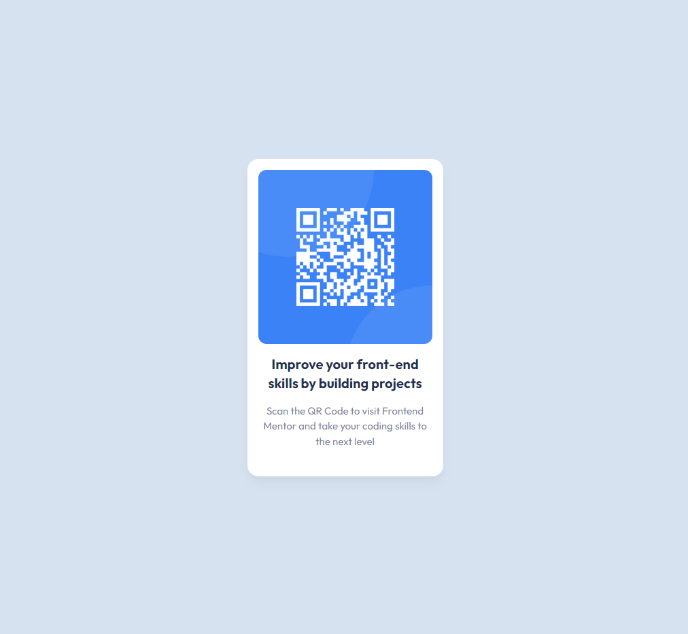

# Frontend Mentor - QR code component solution

This is a solution to the [QR code component challenge on Frontend Mentor](https://www.frontendmentor.io/challenges/qr-code-component-iux_sIO_H).

## Table of contents

- [Overview](#overview)
  - [Screenshot](#screenshot)
  - [Links](#links)
- [My process](#my-process)
  - [Built with](#built-with)
  - [What I learned](#what-i-learned)
- [Author](#author)

## Overview

### Screenshot



### Links

- Solution URL: [Github](https://github.com/ARogueOtaku/qrcode)
- Live Site URL: [QR Code Vercel](https://otaku-qrcode.vercel.app/)

## My process

### Built with

- Semantic HTML5 markup
- Flexbox
- Mobile-first workflow
- [React](https://reactjs.org/) - JS library
- [Next.js](https://nextjs.org/) - React framework
- [Tailwind CSS](https://tailwindcss.com/) - For styles

### What I learned

This project helped me understand how to Create and Customize QRCodes and render them into an Image using the `qrcode` library.

Some Snippets highlighting the same:

```tsx
import Image from "next/image";
import { useCallback, useEffect, useState } from "react";
import QRCode from "qrcode";
import type { QRCodeRenderersOptions } from "qrcode";

export interface IQRCodeImageProps {
  data: string;
  alt: string;
  size?: number;
  qrOptions?: QRCodeRenderersOptions;
}

export default function QRCodeImage({
  data,
  alt,
  size = 16,
  qrOptions = {},
}: IQRCodeImageProps) {
  const [src, setSrc] = useState<string>("");

  const fetchSrc = useCallback(async () => {
    setSrc(await QRCode.toDataURL(data, qrOptions));
  }, [data, qrOptions]);

  useEffect(() => {
    fetchSrc();
  }, [fetchSrc]);

  return <Image src={src} alt={alt} width={size} height={size} />;
}
```

## Author

- Website - [ARogueOtaku](https://arogueotaku.github.io/resume)
- Frontend Mentor - [@arogueotaku](https://www.frontendmentor.io/profile/ARogueOtaku)
- LinkedIn - [@Amit Das](https://www.linkedin.com/in/arogueotaku/)
